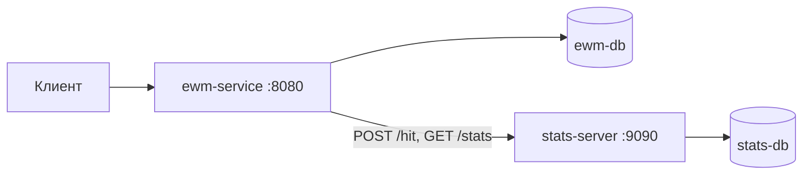

# Explore With Me

Афиша событий: приложение позволяет пользователям делиться информацией об интересных событиях и находить компанию для участия в них.

Проект состоит из двух самостоятельных сервисов:

* **Основной сервис** (`ewm-service`) — вся бизнес-логика продукта: пользователи, категории, события, заявки на участие и подборки.
* **Сервис статистики** (`stats-server`) — сохраняет информацию об обращениях к эндпоинтам и отдаёт выборки для анализа работы приложения.

У каждого сервиса своя база данных PostgreSQL. Основной сервис обращается к сервису статистики по HTTP через отдельный модуль-клиент.



## Стек

Java 21 · Spring Boot 3.3.2 · Spring Web · Spring Data JPA · Hibernate · PostgreSQL 16.1 · Maven (многомодульный) · Lombok · Docker / Docker Compose · Spring Boot Actuator

## Структура модулей

```
explore-with-me
├── stats-service                 родительский модуль статистики
│   ├── stats-dto                 общие DTO для сервиса и клиента
│   ├── stats-client              HTTP-клиент статистики (RestTemplate)
│   └── stats-server              HTTP-сервис статистики
└── main-service                  основной сервис
```

`main-service` зависит от `stats-client`, а `stats-server` и `stats-client` — от `stats-dto`. Благодаря общему модулю DTO сервис и клиент используют одни и те же объекты запросов и ответов.

Основной сервис организован по функциональным пакетам: `user`, `category`, `event`, `request`, `compilation`, а также `exception` (обработка ошибок) и `util` (общие константы и пагинация).

## Запуск

Требуются Docker и JDK 21.

```bash
mvn clean package
docker-compose up --build
```

Docker Compose поднимает четыре контейнера:

| Контейнер | Назначение | Порт |
|---|---|---|
| `ewm-service` | основной сервис | 8080 |
| `ewm-db` | PostgreSQL основного сервиса | 6542 |
| `stats-server` | сервис статистики | 9090 |
| `stats-db` | PostgreSQL сервиса статистики | 6541 |

Проверка работоспособности: `GET http://localhost:8080/actuator/health` и `GET http://localhost:9090/actuator/health`.

## API основного сервиса

API разделён на три части: публичную, закрытую и административную.

### Публичный API

Доступен без регистрации. Обращения к спискам событий и к карточке события фиксируются в сервисе статистики.

| Метод | Эндпоинт | Описание |
|---|---|---|
| GET | `/categories` | список категорий |
| GET | `/categories/{catId}` | категория по идентификатору |
| GET | `/events` | поиск событий с фильтрацией и сортировкой (`EVENT_DATE`, `VIEWS`) |
| GET | `/events/{id}` | полная информация об опубликованном событии |
| GET | `/compilations` | список подборок |
| GET | `/compilations/{compId}` | подборка по идентификатору |

### Закрытый API

Для авторизованных пользователей.

| Метод | Эндпоинт | Описание |
|---|---|---|
| GET | `/users/{userId}/events` | события, добавленные пользователем |
| POST | `/users/{userId}/events` | добавить событие |
| GET | `/users/{userId}/events/{eventId}` | своё событие целиком |
| PATCH | `/users/{userId}/events/{eventId}` | изменить своё событие |
| GET | `/users/{userId}/events/{eventId}/requests` | заявки на своё событие |
| PATCH | `/users/{userId}/events/{eventId}/requests` | подтвердить или отклонить заявки |
| GET | `/users/{userId}/requests` | свои заявки на чужие события |
| POST | `/users/{userId}/requests` | подать заявку на участие |
| PATCH | `/users/{userId}/requests/{requestId}/cancel` | отменить свою заявку |

### Административный API

| Метод | Эндпоинт | Описание |
|---|---|---|
| GET | `/admin/users` | список пользователей |
| POST | `/admin/users` | добавить пользователя |
| DELETE | `/admin/users/{userId}` | удалить пользователя |
| POST | `/admin/categories` | добавить категорию |
| PATCH | `/admin/categories/{catId}` | изменить категорию |
| DELETE | `/admin/categories/{catId}` | удалить категорию |
| GET | `/admin/events` | поиск событий по фильтрам |
| PATCH | `/admin/events/{eventId}` | модерация: публикация или отклонение |
| POST | `/admin/compilations` | добавить подборку |
| PATCH | `/admin/compilations/{compId}` | изменить подборку |
| DELETE | `/admin/compilations/{compId}` | удалить подборку |

## API сервиса статистики

| Метод | Эндпоинт | Описание |
|---|---|---|
| POST | `/hit` | сохранить информацию об обращении к эндпоинту |
| GET | `/stats` | статистика за период по списку `uris`, с учётом флага `unique` |

## Жизненный цикл события

| Состояние | Когда наступает |
|---|---|
| `PENDING` | сразу после создания события — ожидание модерации |
| `PUBLISHED` | администратор опубликовал событие |
| `CANCELED` | администратор отклонил событие либо инициатор отменил его на этапе ожидания |

Количество просмотров события берётся из сервиса статистики, количество подтверждённых заявок считается по заявкам со статусом `CONFIRMED`.

## Формат даты и времени

Во всех запросах и ответах используется формат `yyyy-MM-dd HH:mm:ss`. Значения дат в query-параметрах должны быть закодированы (URL encoding).

## Обработка ошибок

Ошибки возвращаются в едином формате `ApiError` с полями `status`, `reason`, `message`, `timestamp`.

| Код | Когда возвращается |
|---|---|
| 400 | некорректный запрос или невалидные данные |
| 404 | объект не найден |
| 409 | нарушение целостности данных или невыполнение условий операции |

## Спецификации API

* [ewm-main-service-spec.json](ewm-main-service-spec.json) — спецификация основного сервиса
* [ewm-stats-service-spec.json](ewm-stats-service-spec.json) — спецификация сервиса статистики

Спецификации удобно просматривать в [Swagger Editor](https://editor.swagger.io): `File → Import file`.
